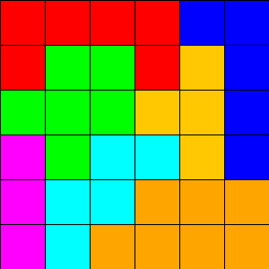

# Tugas Kecil 1 IF2211 Strategi Algoritma: Penyelesaian IQ Puzzler Pro Menggunakan Algoritma Brute Force  


## IQ Puzzler Pro 


IQ Puzzler Pro adalah permainan **puzzle strategi** di mana pemain harus menempatkan kepingan berbentuk unik ke dalam papan hingga seluruh ruang terisi tanpa tumpang tindih. 

Brute Force adalah metode **pencarian solusi dengan mencoba semua kemungkinan kombinasi**.  

Program ini **membaca puzzle dari file input**, **mencari solusi menggunakan brute force dengan backtracking**, lalu **menyimpan solusi dalam file teks (.txt) dan gambar (.png)**.

---

## Struktur Project
📁 project-root  
│── 📁 bin  
│── 📁 doc      
│── 📁 src  
│    ├── Main.java  
│    ├── Board.java  
│    ├── Piece.java  
│    ├── BruteForceSolver.java  
│    ├── FileIO.java  
│── 📁 test  
│    ├── testcase1.txt  
│── 📁 test/solution_file  
│── 📁 test/solution_image  
│
│── README.txt  

---

## Format Input (.txt)
**Ketentuan Format:**
- **Baris pertama**: `{N} {M} {P}` → Ukuran papan dan jumlah kepingan.
- **Baris kedua**: `"DEFAULT"` (saat ini hanya mendukung mode ini).
- **Baris selanjutnya**: Setiap kepingan ditandai dengan perubahan huruf (misal A → B → C, dll.).
- **Contoh Format Input**:
   ```bash
    5 5 7
    DEFAULT
    A
    AA
    B
    BB
    C
    CC
    D
    DD
    EE
    EE
    E
    FF
    FF
    F
    GGG
---

## Cara Menjalankan Program

1. **Clone repository ini**:
   ```bash
   git clone https://github.com/0xNathaniel/Tucil1_13523013.git
   cd Tucil_13523013
2. **Pastikan Java ter-install dan jalankan**:
   ```bash
   java -cp bin Main
3. **Masukkan nama file input**:
   ```bash
   Nama file input (.txt): <filename>
## Pilihan Output
1. **Output di terminal**
2. **Output sebagai file .txt**
3. **Output sebagai file Image .png**

Contoh output Image: 

